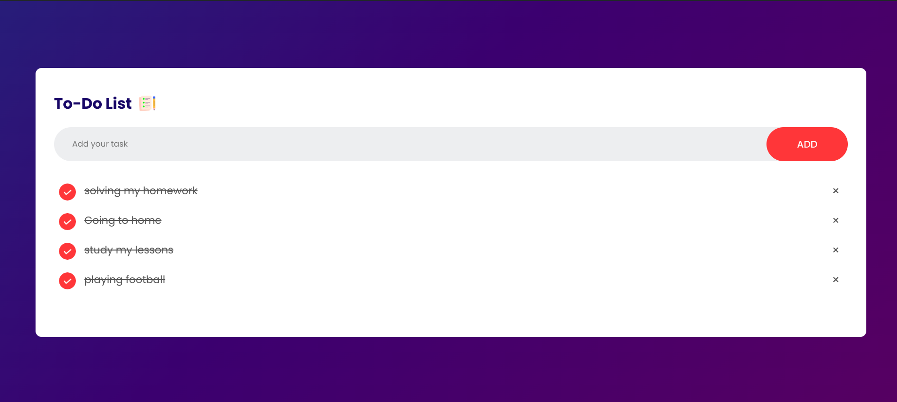

# To-Do List App

This is a small app that enables you to perform basic __CRUD__ operations:

## Features:
- **Add a new task**  
  - If you try to add an empty task, an alert message will notify you to input a valid task.
- **Remove a task**  
  - You can delete any task from your list by clicking the "X" button next to it.
- **Mark task as completed**  
  - You can mark any task as completed by clicking the checkmark button. Completed tasks are visually differentiated by being crossed out.

## Instructions:

1. **Add a Task:**
   - Input your task in the text field and press the **Add** button. 
   - If no text is entered, the app will display a warning message to prevent adding empty tasks.

2. **Mark as Completed:**
   - To mark a task as complete, simply click the checkmark icon beside the task.
   - The task will be visually marked as completed with a strikethrough.

3. **Remove a Task:**
   - You can remove a task by clicking the "X" icon next to it.

## Technologies Used:
- HTML
- CSS
- JavaScript (for handling the task operations)

## Future Enhancements:
- Add task categories
- Implement task deadlines with notifications
- Allow task reordering via drag-and-drop

## Video Demo:

[![Watch the video]](https://www.youtube.com/watch?v=OyQcgfkDMyU)

Click the image above to watch the demo video.
